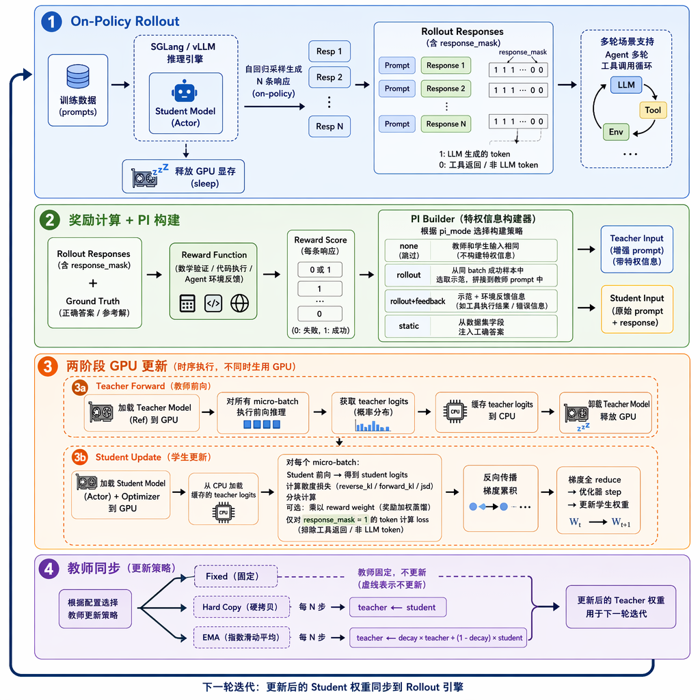

# OPSD：内存高效的在策略蒸馏训练框架

基于 `verl` 框架构建的**在策略蒸馏（On-Policy Distillation）**训练仓库，用于将大型"教师"语言模型的知识高效蒸馏到较小的"学生"模型中。支持单轮数学推理和多轮 Agent 工具调用两种场景。

## 算法架构



## 核心特性

### 两阶段内存高效蒸馏

OPD 采用两阶段 GPU 调度避免同时加载教师和学生模型：

1. **阶段一（教师）**：加载教师模型，对所有 micro-batch 前向推理，将 logits 缓存到 CPU，卸载教师
2. **阶段二（学生）**：加载学生模型和优化器，从 CPU 加载教师 logits，计算散度损失并反向传播

### 散度损失函数

支持三种散度类型（均采用分块计算避免 OOM）：

| 类型 | 说明 |
|------|------|
| `reverse_kl` | KL(学生‖教师)，模式寻求，学生聚焦教师高概率 token |
| `forward_kl` | KL(教师‖学生)，均值寻求，学生覆盖教师所有模式 |
| `jsd` | Jensen-Shannon 散度，两者的平衡插值 |

### Token Scope 策略

- **`full_vocab`**：比较完整词表分布（最准确）
- **`topk`**：只比较教师 top-K 个 token（减少噪声，节省内存）
- **`sampled_token`**：只比较生成 token 的 log-prob（最省内存）

### 特权信息（PI）模式

- `none`：标准 OPD，教师与学生看到相同输入
- `static`：教师从数据字段获取正确答案
- `rollout`：教师从成功 rollout 中获取示范
- `rollout+feedback`：rollout PI + 环境反馈

### 多轮 Agent 循环

支持多轮工具调用场景（ALFWorld、WebShop、SWE 等），蒸馏仅针对 LLM 生成的 token 部分，工具/环境返回的 token 通过 `response_mask` 自动排除。

### 教师更新策略

支持三种教师模型更新模式：

| 模式 | 说明 |
|------|------|
| **固定教师（Fixed）** | 教师模型全程不更新，通常使用独立的大模型作为教师 |
| **硬拷贝（Hard Copy）** | 每 N 步将学生权重完整拷贝给教师 |
| **EMA 滑动平均** | 每 N 步做指数移动平均更新：`teacher = decay × teacher + (1 - decay) × student` |

## 项目结构

```text
scripts/
  eval/           # 评估脚本
  grpo/           # GRPO 基线训练脚本
  opd/            # OPD/OPSD 训练脚本
  utils/          # 工具脚本（checkpoint 转换等）
src/
  common/         # 共享的 batch 构建工具
  data/           # 数据准备脚本
  opd/            # 核心 OPD 模块（训练器、worker、损失函数）
  rewards/        # 奖励函数（数学、代码、Agent 等）
  tools/          # Agent 工具集成（搜索、ALFWorld、WebShop、SWE）
```

## 支持的任务

| 数据集 | 类型 | 训练脚本 |
|--------|------|---------|
| DAPO-Math-17k | 数学推理 | `train_opsd_dapo.sh` |
| OpenThoughts | 数学推理 | `train_opsd_openthoughts.sh` |
| LiveCodeBench | 代码生成 | `train_opsd_livecodebench.sh` |
| SciKnowEval | 科学问答 | `train_opsd_sciknoweval.sh` |
| SearchQA | 搜索检索 | `train_opsd_searchqa.sh` |
| ToolUse | 工具调用 | `train_opsd_tooluse.sh` |
| ALFWorld | 交互式 Agent | `train_opsd_alfworld.sh` |
| WebShop | 网购 Agent | `train_opsd_webshop.sh` |
| SWE-Gym | 软件工程 | `train_opsd_swe_gym.sh` |

## 环境要求

- **Python**: 3.10
- **CUDA**: 12.8


核心依赖版本：

| 包 | 版本 | 
|---|---|---|
| torch | 2.8.0+cu128 | 
| verl | 0.7.0dev0|
| sglang | 0.5.2  |
| uvicorn | 0.40.0| 
| transformers | 4.56.1 | 
| flash_attn | 2.8.4 | 
| flashinfer | 0.3.1 | 
| ray | 2.55.1 | |

完整依赖见 `requirements.txt`。

### 环境配置

训练脚本会自动加载项目根目录的 `.env` 文件（已 gitignore），需包含：

```bash
# .env 模板
export PATH="/path/to/conda/envs/opsd/bin:$PATH"
source /opt/rh/gcc-toolset-13/enable 2>/dev/null || true  # CentOS GCC 升级
export HF_HOME="/path/to/.cache/huggingface"
export WANDB_API_KEY="your_key"
export MODEL_PATH="/path/to/model"
export no_proxy="127.0.0.1,localhost"   # 绕过 HTTP 代理（如有）
export NO_PROXY="127.0.0.1,localhost"
export RAY_ADDRESS=""                   # 避免连接已有 Ray 集群
export TORCH_CUDA_ARCH_LIST="9.0"      # H20/H100: 9.0, A100: 8.0
export TOKENIZERS_PARALLELISM="false"
```

## 快速开始

### OPD 训练（独立教师，单轮数学）

```bash
MODEL_PATH=/path/to/student_model \
TEACHER_MODEL_PATH=/path/to/teacher_model \
MODEL_NAME=my-model \
bash scripts/opd/train_opd.sh
```

### OPD 训练（多轮 Agent 工具调用）

```bash
MODEL_PATH=/path/to/student_model \
TEACHER_MODEL_PATH=/path/to/teacher_model \
DATABASE_DIR=/path/to/tool/database \
MODEL_NAME=my-model \
bash scripts/opd/train_opd_agent.sh
```

### GRPO 基线训练

```bash
MODEL_PATH=/path/to/model \
MODEL_NAME=my-model \
bash scripts/grpo/train_grpo.sh
```

### 评估

```bash
MODEL_PATH=/path/to/model \
INSTRUCTION_VARIANT=boxed \
REWARD_FUNCTION=math_reward \
bash scripts/eval/eval_math.sh
```

### Checkpoint 转换

```bash
CHECKPOINT_PATH=/path/to/global_step_54/actor \
bash scripts/utils/convert_checkpoint.sh
```

## 内存优化机制

- **两阶段 GPU 调度**：教师和学生不同时占用 GPU
- **分块散度计算**：避免实例化完整 (N, V) 概率张量
- **FSDP offload**：参数和优化器状态可卸载到 CPU
- **Remove-padding**：计算量仅与实际 token 数成正比
- **Micro-batching**：梯度累积控制峰值内存
- **动态 batch sizing**：适应变长响应
- **KV-cache 内存控制**：rollout 阶段可配置显存占用上限

## 许可证

研究用途。
